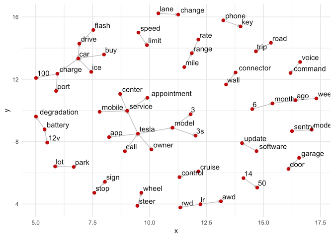
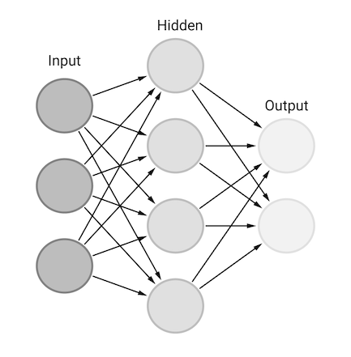

Title: Portfolio
Date: 2021-11-20
Modified: 2021-11-20
Slug: portfolio
Authors: Brian Roepke
Header_Cover: images/cranes_night.jpg
Og_Image: images/cranes_night.jpg
Twitter_Image: images/cranes_night.jpg

*The following are a few projects I've worked on, mostly in context of my recent undergraduate degree in Data Analytics.  Other examples available upon request.*
## Tesla User Forums "Voice of Customer" Analysis

In 2006 Elon Musk wrote a blog post titled, [The Secret Tesla Motors Master Plan (just between you and me)](https://www.tesla.com/blog/secret-tesla-motors-master-plan-just-between-you-and-me), where he detailed out the strategy for the company.  In this post, he offered up a multi-step plan to achieve the [mission](https://www.tesla.com/about) slated by the company:

> Tesla's mission is to accelerate the world's transition to sustainable energy.

The plan detailed four steps that would eventually lead to what is known as the Tesla Model 3, the first affordable, high-performance, no-compromise electric car.  As of March 2020, the model 3 became the all-time best selling plug-in electric car surpassing the Nissan LEAF, and it accomplished this in just 2.5 years, versus ten years for the LEAF.

As the plan noted, the goal was to build a more affordable car accessible to more people than the previous premium market products.  The Model 3 was launched with a $35,000 price point making it competitive with entry-level German vehicles.  It was met with an incredible reception garnering 200,000 pre-orders in the first 24 hours after it's launch. It's since sold 500,000 units and continues to be loved.

However, while the company is doing fantastic, its stock at all-time highs and soon entering the S&P 500 has seen its share of Quality issues.  In June of 2020, J.D. Power released its annual quality study showing that Tesla was ranked last among 32 automotive brands.  Bloomberg performed a survey of 5,000 Model 3 owners published in October of 2019, where owners submitted details of their quality issues.  Owners stated that the most significant problems were with paint and panel gaps.  While the report found that cars' defects cut in half over time, Tesla is still working to optimize its production.  

This report will look at user's discussions, mostly in 2020, from the [Tesla Model 3 Discussion Forums](https://forums.tesla.com/categories/tesla-model-3) to surface what is top of mind and what issues might still be effecting the Model 3.  The forums are an open place where people can post topics, ask questions, or generally participate in the community.  User forums are rich with information that can give an alternative view into customer sentiment, unlike Social Media or traditional Surveys. 

**Note:** This report will not look to surface the root cause of issues, positive or negative, but rather surface topics that are most top-of-mind for customers and where the Tesla team could investigate further.

The following analyses were conducted:

1. Perform **lexicon-based sentiment analysis** on forum posts using Bing and AFINN lexicons.
1. Utilize **n-Grams** to identify potential topics of interest.
1. Build **Topic Models** utilizing **Latent Dirichlet Allocation** (LDA) and interpret results.
1. Identify top **Features of the vehicle** from the **n-Grams** and **Topic Models** and perform sentiment analysis on a per-feature basis.

[View the Full Analysis Here](../other/tesla.html)

## Analyzing Yelp Reviews

The concept of social ratings and reviews of products is a common model of recommendation that the internet-enabled. We use reviews in nearly all aspects of eCommerce.  Products on Amazon contain reviews and ratings that help us find the top-rated product.  Reviews on TripAdvisor help us find the best places to have a vacation.  For businesses and restaurants, a common destination is **Yelp**.  Headquartered in San Francisco, California, it develops, hosts, and markets the Yelp.com website and the Yelp mobile app, which publish crowd-sourced reviews about businesses. It also operates an online reservation service called Yelp Reservations.  As of June 30, 2019, Yelp stated they had 192 million reviews on their site.

How important are these reviews to businesses? Reviews become a critical way for us to find trusted information, and that translates to more business. According to a Professor at Harvard Business School, an analysis of Yelp reviews found that each star rating for a business translated to a 5-9% increase in revenues.

Yelp has opened up a large portion of its dataset for academic and personal use. It contains a massive amount of textual data from their reviews and other information about their businesses.  The following analysis uses a subset of that information to try to understand the following questions better:

1. Leveraging a **lexicon-based sentiment** polarity score, find the most positive and negative **words frequencies** across reviews and what insights this brings.
2. Utilizing a Machine Learning model for **classification** determines the relationship between the **text** of the review and its **rating**. Is there a relationship between what people write about a business to the star rating they give it? Can this be combined with any other data to improve this prediction?
3. Use a Machine Learning **Multi-label classification** model to see what **categories** would an algorithm recommended a business use and how they related to the ones that a business manually chose.
4. Build a **Neural Network** using [TensorFlow](https://www.tensorflow.org) with **text** as input layer and the review rating as output if we can improve on the statistical Machine Learning model above.

[View the Full Analysis Here](../other/yelp.html)

