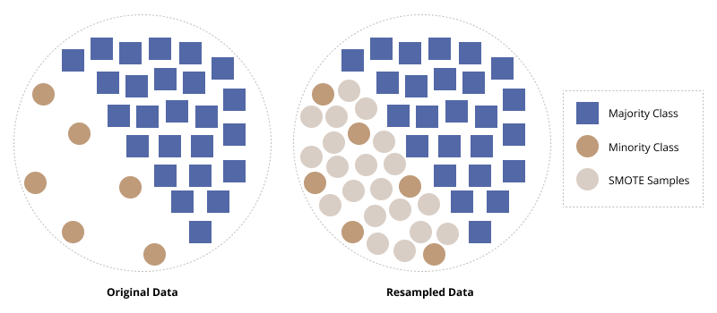

Title: Working with Imbalanced Data
Date: 2021-11-25
Modified: 2021-11-25
Category: SQL
Tags: datascience, machine learning, python
Slug: imbalanced
Authors: Brian Roepke
Summary: Multiple techniques for dealing with imbalanced data from algorithm selection to synthetic data generation.
Header_Cover: images/time.jpg
Og_Image: images/time.jpg
Twitter_Image: images/time.jpg

## What is Imbalanced Data

**Imbalanced data** is a case that is incredibly common in Machine Learning applications. Imbalanced data occurs when you have many observations in your data that represent one type of class and other classes that are much smaller. Examples of this might be fraudulent *credit card transactions* relative to legitimate purchases or potentially *spam emails* relative to legitimate emails (It's also probable that legitimate emails are the minority these days).

## What is the Challenge? 

The challenge you will run into with imbalanced data is around how algorithms learn off of your data. As you build a train/test dataset, the number of observations representing the minority class will be much smaller than the majority. The algorithm doesn't have enough data to truly model what the minority class will look like and ends up over-biasing to the majority class. It can be especially dangerous to use a simple *Accuracy* metric to evaluate your model or look for high precision or recall towards the minority class. More on [evaluation metrics](modeleval.html) later.

## Methods for Working with Imbalanced Data

Fortunately, with a little additional thought and set up in your training and testing phases, you can deal with imbalanced data; there are numerous ways to handle imbalanced data. The following are some (not all) of the ways you can manage it:

1. Algorithm Selection
2. Generating synthetic data
3. Choosing the right performance metric

## Algorithm Selection

Let's start with the most simple way. In this example, I'll refer to Scikit-Lern's algorithm selection and how they handle imbalanced data. Many of their algorithms support a `class_weight` parameter which can be set to `balanced`. For example, `RandomForest`, `LogisticRegression`, `Perceptron`, and `SVM` support this parameter. According to the [documentation](https://scikit-learn.org/stable/modules/generated/sklearn.ensemble.RandomForestClassifier.html?highlight=class_weight): 

>**class_weight{“balanced”, “balanced_subsample”}, dict or list of dicts, default=None** 
>Weights associated with classes in the form `{class_label: weight}`. If not given, all classes are supposed to have weight one. For multi-output problems, a list of dicts can be provided in the same order as the columns of `y'.

>The "balanced" mode uses the values of `y` to automatically adjust weights inversely proportional to class frequencies in the input data as `n_samples / (n_classes * np.bincount(y))`

If during your model selection phase you find that one of these classifiers performs well, it's quite simple to use this feature of the algorithm to accommodate for 

### Train/Test Split and Cross-Validation

Since the data is imbalanced, you should always split your data in such as way that preserves the class proportions. `train_test_split` automatically defaults to split data via the `stratify=None` parameter. 

When performing cross-validation for model evaluation, you should use the `StratifiedKFold` cross-validator. It will ensure that the folds are made by preserving the percentage of samples for each class [^STRAT].

**Important Note:** This step is critical. Without this, you may end up with zero minority class samples in your test.

## SMOTE

Synthetic Minority Oversampling Technique (SMOTE) uses a nearest-neighbor approach for generating new minority class samples. The method is applied *only to the training data* and then tested on the original, *untouched* test partition. The method chosen here is first to oversample the minority class making it balanced, and then undersample it to reduce the size and bloat [^PAPER].



By synthetically generating minority class observations that are *similar* but not identical to other minority class observations, we can improve the model's performance on the minority class.

The package [imblearn](https://imbalanced-learn.org/stable/index.html) contains the SMOTE algorithm and can easily be integrated into SKLearn pipelines.

**Important Note:** Never perform SMOTE on your **test** dataset, only on the **train** partition!

**Implementation Note:** You must import the `imblearn` pipeline instead of the sklearn pipeline, or it will not work.

```python
from imblearn.pipeline import Pipeline
from imblearn.over_sampling import SMOTE
from imblearn.under_sampling import RandomUnderSampler

pipeline = Pipeline([('prep',column_trans),
                     ('over', SMOTE(random_state=42)),
                     ('under', RandomUnderSampler(random_state=42)),
                     ('clf', clf)])
```

**More: **For more information on utilizing pipelines, check out my post: [Using Pipelines in Sci-kit Learn](sklearnpipelines.html).

## Evaluating Results

Finally, choosing the right evaluation metric is critical with imbalanced data. If you're relying on Accuracy, you're most likely not going to achieve the results you think you are. Please look at my other post on [Evaluating Models with a Confusion Matrix](modeleval.html). 

# Conclusion

There are many great articles out there, such as the full walkthrough from Jason Brownlee on *Machine Learning Mastery* [^SMOTE] and Tara Boyle on *Towards Data Science* [^IMBAL]. Check them out for further learning.

## References

[^PAPER]: [SMOTE: Synthetic Minority Over-sampling Technique](https://doi.org/10.1613/jair.953)
[^STRAT]: [Cross-validation: evaluating estimator performance](https://scikit-learn.org/stable/modules/cross_validation.html)
[^IMBAL]: [Dealing with Imbalanced Data](https://towardsdatascience.com/methods-for-dealing-with-imbalanced-data-5b761be45a18)
[^SMOTE]: [SMOTE for Imbalanced Classification with Python](https://machinelearningmastery.com/smote-oversampling-for-imbalanced-classification/)